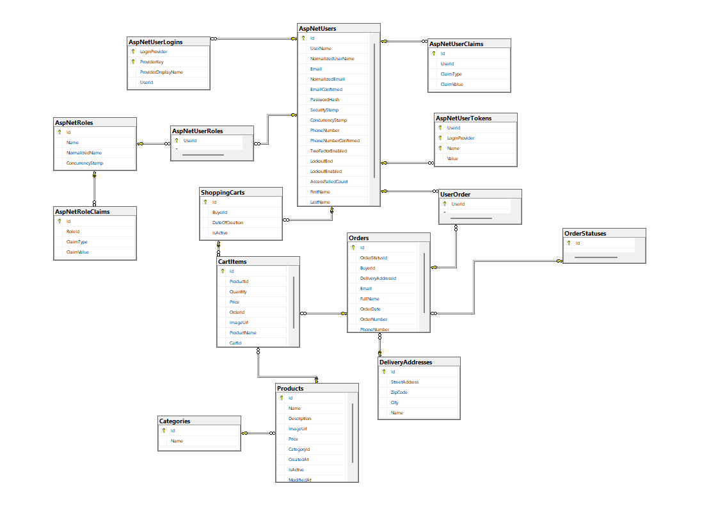

# Burger Mania -- ASP.NET Core Project
 [Visit Burger Mania](https://burgermaniaapp.azurewebsites.net/)

Project for the final ASP.NET exam at SoftUni. A burger shop.

## Project Info
The application has three areas 
- User - everyone is user;
- Deliverer -  only available to users with "Deliverer" role;
- Admin - only available to users with "Administrator" role;

## User Actions
Admin can:
- create products;
- edit products;
- delete product;
- see all users;
- add roles to user;

User can:
- browse the store;
- view product details;
- add products to their cart;
- finalize their orders;
- view their order history;

Guests can:
- view home page;
- register/login;
- most pages don't allow annonymous.

## DB Scheme

